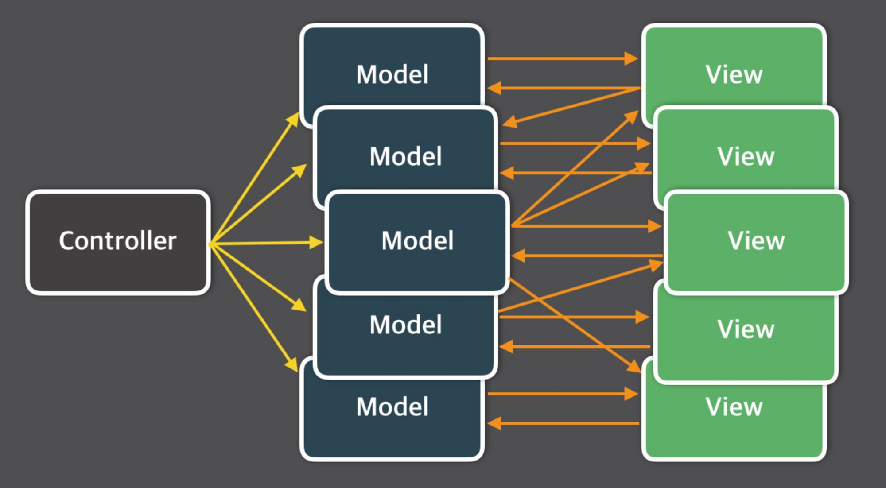
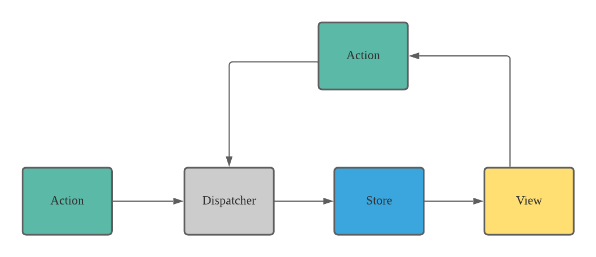

# 📚 Flux Pattern 

## 📖 React는 왜  Flux Pattern을 사용했는가?
- Agular는 MVC 패턴으로 양방향 데이터 바인딩
- MVC 패턴에서는 데이터의 양이 많아졌을때 유지보수와 디버깅이 어려워짐

- Flux 패턴은 예측 가능한 앱을 만들기 위해 Facebook이 제안한 아키텍처 패턴
- 데이터는 부모 -> 자식으로 단방향으로 흐름
- 디버깅하기 쉬워지고 각 요소의 책임이 나뉘어 코드를 유지보수하거나 확장하기 좋음

 

## 📖 구성요소
### 📍 aciton
- 모든 이벤트를 의미
- type, payload를 포함하는 객체

  

### 📍 dispatcher
- 액션을 받아서 모든 스토어에 전달 → 스토어 업데이트
- 데이터 흐름을 중앙에서 관리하는 역할

  

### 📍 store
- 상태와 로직을 관리
- 상태가 변경되면 뷰에게 알려줌

  

### 📍 view
- ui를 구성하는 요소로 React 컴포넌트를 의미
- 스토어에서 상태를 받아서 렌더링 됨
- 뷰는 사용자의 입력을 받아서 액션을 생성

  

## 📖 데이터 흐름
1. 사용자가 뷰에서 동작을 수행하면 
2. 뷰는 대응하는 액션을 생성 
3. 생성된 액션을 디스패처가 받아서 스토어로 전달 
4. 스토어는 액션을 받아서 state를 업데이트
5. 상태가 변경되면 스토어는 뷰에 알리고 상태가 변경되었을 때 뷰는 다시 렌더링 됨

 

## 🗂️ 참고
[Flux 패턴 설명- velog](https://velog.io/@beberiche/%EC%8B%B1%EA%B8%80%ED%86%A4-%ED%8C%A8%ED%84%B4%EA%B3%BC-Flux-%ED%8C%A8%ED%84%B4%EC%97%90-%EB%8C%80%ED%95%B4-%EC%84%A4%EB%AA%85%ED%95%B4%EC%A3%BC%EC%84%B8%EC%9A%94)
