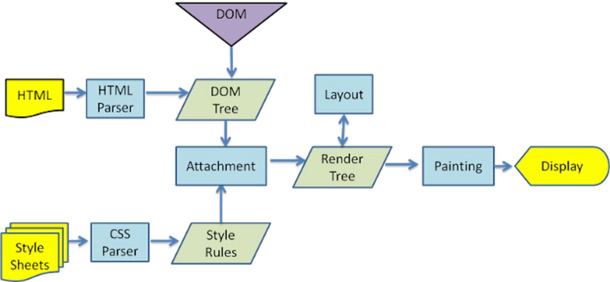

# 📚 Hydration

## 📖 Critical Rendering Path(CRP)
- HTML, CSS, JS를 브라우저에 그리는 과정 
    * HTML을 파싱해서 DOM을 생성
    * CSS 파싱 후 CSSOM 생성
    * Layout 계산
    * 초기 Painting 진행, 계산된 스타일과 레이아웃 기반으로 픽셀 그리기 

- SSR을 사용하게 되면 추가적인 과정으로 2단계를 더 거침
    * JS 로드 및 실행
    * Hydration 진행

 

## 📖 Hydration이란 ?
### 📍 메마른 HTML에 촉촉한 JS 연결하기
- 서버측에서 보낸 HTML을 읽고 Hydration으로 Virtual DDOM과 비교해 이벤트 핸들러를 연결
- 미리 렌더링한 HTML 파일이 화면에 그려져도 Hydration이 끝나기 전에는 이벤트 리스너가 동작하지 않음

  

### 📍 Hydration을 효과적으로 진행하기 위해서는?
- Hydration이 느리면 페이지를 볼 수 있지만 촉촉한 JS가 연결되지 않았기 때문 interaction을 할 수 없음
- 따라서 Hydration이 느린 원인으로는 JS 번들 크기가 큰 경우 또는 HTML을 생성하는 서버 응답이 느린 경우가 있음
- React와 같은 CSR 라이브러리는 커다란 JS 파일을 가져와 DOM을 렌더링, 초기 속도 저하가 되는 단점이 존재
- JS 번들 크기가 클수록 TTI(Time to interactive)가 늦어짐
- 코드 스플릿팅 또는 트리 쉐이킹으로 상황에 맞는 최적화를 진행할 수 있음
- 서버에서 HTML이 생성되기 전까지 다른 interaction이 block되는 현상을 개선하기 위해서 Selective Hydration 진행(React 18v)
- Suspense로 감싸고 감싸진 영역의 data가 fetching되는 동안 나머지 페이지의 HTML을 스트리밍할 수 있음
- Next JS는 알아서 코드스플릿팅을 해주기 때문에 필요하지 않은 코드를 초기 로드 시에 포함하지 않아 빠른 속도로 JS 번들을 가져옴
- 또한 preloading을 통해서 필요한 렌더링 방식을 선택할 수 있음

  

## 🗂️ 참고
[Hydration - velog 참고](https://velog.io/@hamjw0122/Next.js-Hydration)